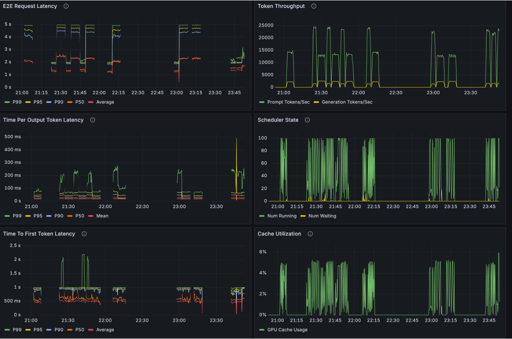
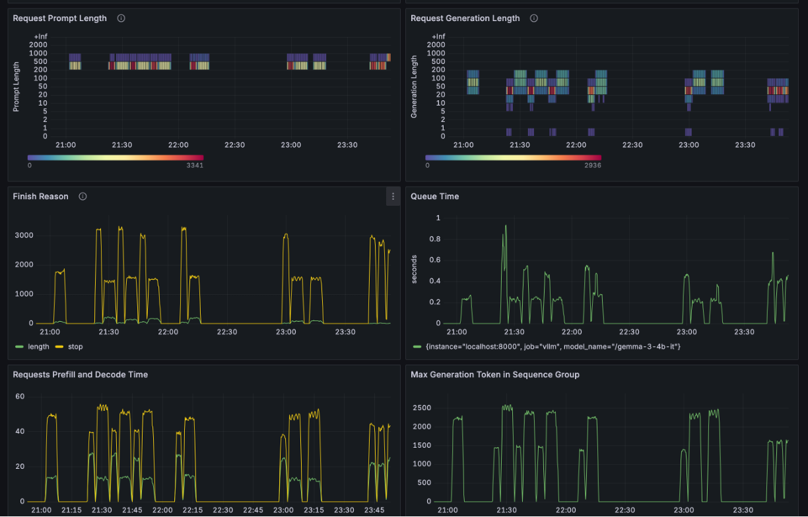
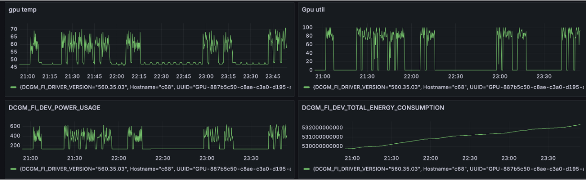
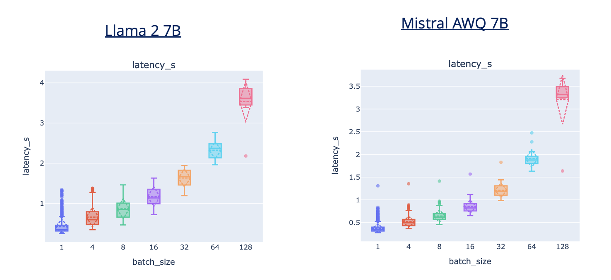
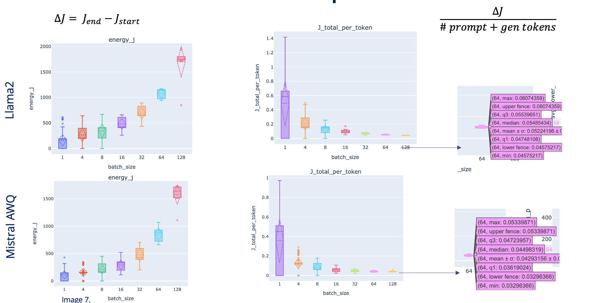
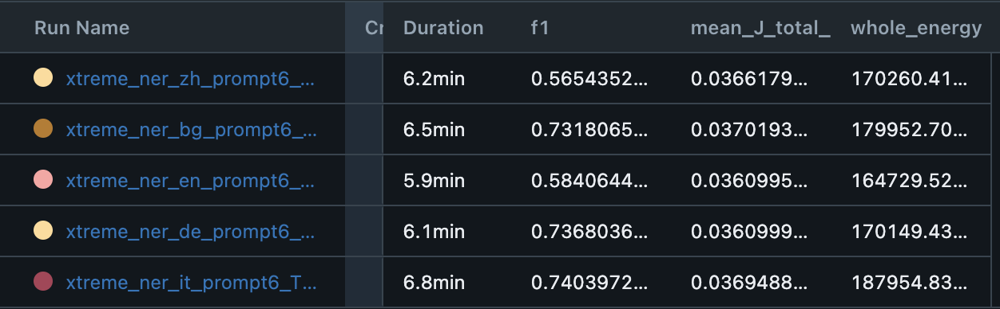

# Energy Consumption Measurement for Multilingual NER with Large Language Models

This repository contains code and experiments for measuring the energy efficiency of various Large Language Models (LLMs) when performing Named Entity Recognition (NER) tasks across multiple languages. The experiments focus on comparing Mistral, Gollie, and Gemma models while analyzing their energy consumption per token and total energy usage in joules.

## Repository Structure

```
├── energy_llm_ner_thesis/        
│   ├── src/ 
│       ├──models/               # load model snapshots in this dir, contains example loading function
│       ├──quantization/         # scripts for custom quantization, in progress
│       ├── serve_vllm/           # VLLM serving and metrics collection
│       │   ├── compressed_serving/    # bash scripts for quantized models vllm serving
│       │   ├── containers/            # Dockerfiles for serving and inference (the latter not used anymore, rely on venv)
│       │   ├── evaluation_scripts/
│       │   │    ├── masakha/
│       │   │    │    ├── lang_eval_masakha_oop.py  # in progress, rethinking evaluation (experiment #2) in terms of OOP
│       │   │    │    ├── lang_mistr_eval_mlflow.py  # kinda artifact, will be removed soon
│       │   │    ├── xtreme/ 
│       │   │    │    ├── lang_eval_mlflow_mi_gol.py      # experiment #2 -> THE MAIN EVAL LOGIC, all languages, one dataset
│       │   │    │    ├── xtreme_de_batch_experiment.py  # experiment #1 -> finding the trade-off between batch size and energy usage
│       │   │    ├── eval_llm_batches.py
│       │   │    ├── simple_gollie_eval.py
│       │   ├── gpu_metrics_server/       # time series with GPU metrics are stored here
│       │   ├── inference_eval_artifacts/ # evaluation results of exp #2 stored here (& mlflow)
│       │   ├── monitoring/               # dir for monitoring logs (grafana, prometheus, dcgm, vllm) + db + dashboards
│       │   ├── prompts_in_all_languages/ # prompt engineering, few shots per language
│       │   ├── SERVE_model_bash/         # THE MAIN SERVE LOGIC, all models
│       │   │    ├── gemma/
│       │   │    │    ├── one_node_serve_gemma.sh
│       │   │    │     ├── inference_base_mistral_gemma.sh
│       │   │    │     ├── inference_gemma_all_langs.sh
│       │   │    ├── gollie/
│       │   │    ├── mistral/
│       │   ├── slurm_out/          # slurm job logs
│       │   ├── templates/          # chat templates for models
│       │   ├── two_node_serve_deprecated/   # monitoring and serving on 2 separated nodes, old
│       │   ├── visualizers/  # functions for exp #1 - metrics vs batch size box plots
│       │   ├── collect_gpu_nvml.py     # Script to collect GPU metrics via NVML endpoint continuous scraping
│       │   ├── README_metrics.md   # detailed overview on vllm, gpu metrics
│       │   ├── README_one_node.md  # older version of detailed explanation of one node serve of the model.
```

## Experimental Setup

### Main workflow idea
There are 3 scripts that form a cohesive experimental workflow for evaluating multilingual NER under energy-aware conditions:
- /src/serve_vllm/SERVE_model_bash/<model_name>/one_node_serve_<model_name>.sh: Sets up the backbone — a vLLM server hosting the Mistral/Gemma 3/GoLLIE model, wrapped with a complete monitoring stack (Prometheus, Grafana, Jaeger, DCGM) to track GPU utilization and energy metrics in real time. I use H100-80GB one node, so the models are up to 12B to fit comfortably.

- /src/serve_vllm/SERVE_model_bash/<model_name>/inference_<model>_all_langs.sh: Acts as the orchestrator — running evaluation loops across different languages and prompt settings, while ensuring GPU metrics are continuously collected and experiments are paced with cooldowns.

- /src/serve_vllm/evaluation_scripts/xtreme/lang_eval_mlflow_mi_gol.py: (run inside previous bash script) Delivers the analysis — executing the actual NER benchmarking, parsing model outputs, computing precision/recall/F1, attributing energy costs, and logging everything to MLflow for reproducibility.

Together, they connect serving, evaluation, and monitoring into a unified pipeline for energy-efficient large language model experimentation.

### Task Description

The main task is **multilingual Named Entity Recognition (NER)** using the XTREME/Masakha dataset. The goal is to evaluate how different LLMs perform on this task across multiple languages while measuring their energy consumption. Currently, I focus on the XTREME dataset.

### Models Evaluated

**Why do I consider these models?**

- No additional fine-tuning → rely on zero-/few-shot prompting (to save energy, use what is already created!)
- Evaluate on XTREME/MasakhaNER datasets

 #### Key Criteria:
- Instruction Following → model must reliably produce structured JSON outputs without drifting
- Multilingual Understanding → handle multiple languages (English, German, Bulgarian, Italian, Chinese etc)
- Efficiency → avoid extra training cost; test energy-conscious inference (quantization, smaller models)
#### Chosen Models:
Mistral 7B Instruct v0.2 → strong instruction following
GoLLiE (based on LLaMA-Code) → task-specific IE alignment
Gemma-3 (4B/12B IT) → explicitly multilingual, scalable

- **Mistral-7B-Instruct-v0.2**: [HF](https://huggingface.co/mistralai/Mistral-7B-Instruct-v0.2)
- **Gollie-7B**: [HF](https://huggingface.co/HiTZ/GoLLIE-7B) (based on Llama 2 Code)
- **Gemma-3-4b/12b-it**: [HF](https://huggingface.co/google/gemma-3-4b-it)

### Languages
The experiments are conducted across multiple languages from the XTREME dataset to evaluate the models' multilingual capabilities. We evaluate English and German for 8 different prompts, but consider only one prompt type for all-language evaluation. For brevity, the showcase languages are Italian (it), German (de), English (en), Bulgarian (bg), and Chinese (zh).

### Experiment #1

Evaluation of one language for NER task with simple prompt for a list of batch sizes (from 1 to 128) while capturing energy metrics to demonstrate that larger batch sizes result in less energy per token (utilizing GPU parallelization).

### Experiment #2

Evaluation of all selected languages for a defined batch size with 8 types of prompts. More details below.

### Energy Measurement Methodology

Energy consumption is measured using NVIDIA's Data Center GPU Manager (DCGM) metrics, scraped through the `collect_gpu_nvml.py` script from DCGM exposed port 9400 with GPU metrics (100ms intervals).

Key metrics include:

- GPU utilization, %
- Memory usage, MB
- Temperature, °C
- Power consumption, Watts
- Total energy consumption since boot, Joules

**Refer to [this readme](src/serve_vllm/README_metrics.md) for better energy metric understanding!**

## Energy Efficiency Analysis & Accuracy
**Find high accuracy with lower energy usage**

The collected metrics are used to analyze two key aspects of energy efficiency:

1. **Energy per token**: How much energy (in joules) is required to process each token
2. **Total energy consumption**: The overall energy used during the entire inference process

&

1. **F1**: accuracy score must be relatively high.

## Running Experiments

### Step 1. Prerequisites
1. Set up environment variables in /serve_vllm/.env file (template provided)
   - `CHAT_URL`\`COMPLETION_URL` - where to post requests based on the model type (instruction-tuned use chat endpoint, while generational ones use completions)
   - `ENERGY_URL`: URL to access GPU metrics (constructed based on the node name where the model is hosted and monitored, same as previous)
   - `METRICS_CSV`: Path to save metrics data, where to store it, this will be logged to mlflow during each experiment
   - `METRICS_INTERVAL_MS`: Sampling interval in milliseconds (default: 100ms as in DCGM exporter)
   - `MLFLOW_URL` (user and password as well) - to log experiment.

2. Load the models into `/src/models/base` for evaluation. The same directory has a `load_model.py` function to load a snapshot.
3. Pull docker container designed for vllm serve.

Put it into `./serve_vllm/containers` directory.

```singularity build vllm_serve_otel.sif docker://irv12/vllm_serve_otel:latest```
(note: docker build is restricted on the HPC, only singularity is used, image has to be created locally beforehand)
4. Create venv.

 ```python3.11 -m venv universal-ner-py311``
 source universal-ner-py311/bin/activate

```python -m pip install --upgrade pip```

```pip install -r requirements.txt```
5. Be sure to use pathes adapted to your workspace in all bash script!!!

### Step 2. Host the model

```cd src/serve_vllm```
```sbatch SERVE_model_bash/gemma/one_node_serve_gemma.sh```
### Step 3. Check if the .env file has a node name updated based on the assigned node for the previous task.

### Step 4. Send the simple request with CoNLL-03 dataset.

This is needed to prefill vllm metrics with data, as in my main experiment #1 and #2 logic we scrape for metrics BEFORE request is sent and after. For the "before" to work properly (no NaNs), I have a _base_ script without metric capturing function, just a simple request.
```sbatch SERVE_model_bash/gemma/inference_base_gemma.sh```

### Step 5. Experiment #2 execution
```sbatch SERVE_model_bash/gemma/inference_gemma_all_langs.sh```

Per-run loop

For each (language, prompt_style):

Chooses max_new_tokens by style (here: style 6 → 100, style 8 → 200).

Records a UTC start timestamp: YYYY-MM-DDTHH:MM:SS.ffffff.

Executes the evaluator with srun inside the venv:

python evaluation_scripts/xtreme/lang_eval_mlflow_mi_gol.py \
  --language <lang> \
  --model /gemma-3-4b-it \
  --system-prompt-choice <style> \
  --batch-size 128 \
  --max-new-tokens <per style> \
  --limit 10000 \
  --run-start-timestamp "<UTC ISO ts>" \
  --use-generic-template

Each srun executes an inference pass of the selected language (using its whole test split of the dataset), parses the output, BIO tags, compares gold tags and predicted, calculates F1 score (overall & per entity category), while capturing energy and vllm metrics for each batch and summarizes it. All produced information is logged to MLflow.

## To get the idea about the prompt styles, have a look at `prompts_in_all_languages/Template_system_prompt.json`. The repeating prompts are combined with varying numbers of examples (few-shot prompting). 
#### The idea - progressive complexity:
- Start from naive instructions → gradually add constraints, few-shots, negatives, reasoning.
- Aim: better F1 by pushing models to follow rules more strictly.

#### Trade-off:
- Longer prompts = more tokens to prefill (higher cost & latency).
- Max new tokens: 60 for most prompts.
- Exception: Chain-of-Thought prompt (number 8, the last) → longer reasoning, higher generation cost (150-200).
#### Key balance:
- Richer instructions = better model behavior.
- But comes at token consumption + energy overhead.

1. **No shots**: Basic instruction only
2. **1-shot**: One example pair
3. **Constraints**: Detailed formatting rules
4. **Constraints + 1-shot**: Rules with one example
5. **Constraints + 2-shot**: Rules with two examples
6. **Hard negatives**: Include challenging examples
7. **Rules only**: Explicit formatting rules
8. **Chain of Thought**: Step-by-step reasoning

## Results

#### A glimpse of what we observe on the Grafana dashboard:



#### Experiment #1

! Here two models are observed that are not used anymore, but for reference:




Here we see that even though the time spent on one batch on average increases, since we are utilizing GPU more efficiently, the energy spent per token is less → therefore for experiment #2 the higher batch size will be used aiming at GPU utilization near 95%.

#### Experiment #2

#### Gollie model evaluation.
Check prompts_in_all_languages/gollie_prompts.py to see the prompt style - python code with dataclasses as definitions of NER entities.

| Model | Language | F1 | Energy [J] | Energy per token |
|-------|----------|----|-----------:|-----------------:|
| Gollie | de | 0.6936 | 74090 | 0.0304 |
| Gollie | en | 0.5540 | 67978 | 0.032 |
| Gollie | zh | 0.3543 | 97877 | 0.03 |
| Gollie | ar | 0.0313 | 130367 | 0.028 |
| Gollie | bg | 0.7037 | 92794 | 0.032 |

### Mistral - multiple prompt styles, multiple languages

**Mistral 7B instruct, German (de)**

| Prompt | F1 | Energy [J] | Energy per token |
|--------|----|-----------:|-----------------:|
| 1 | 0.64116 | 37366 | 0.0094 |
| 2 | 0.6415 | 33510 | 0.0085 |
| 3 | 0.6415 | 33328 | 0.00838 |
| 4 | 0.6412 | 33762 | 0.00863 |
| 5 | 0.6408 | 33354 | 0.0083 |
| 6 | 0.65035 | 37394 | 0.00950 |
| 7 | 0.6412 | 33517 | 0.0086576 |
| 8 | 0.6543 | 38772 | 0.0099 |

**Mistral 7B instruct, English (en)**

| Prompt | F1 | Energy [J] | Energy per token |
|--------|----|-----------:|-----------------:|
| 1 | 0.501 | 35799 | 0.00996 |
| 2 | 0.5014 | 33678 | 0.00938 |
| 3 | 0.5006 | 33840 | 0.0094 |
| 4 | 0.5009 | 34044 | 0.0094 |
| 5 | 0.5022 | 33930 | 0.0092 |
| 6 | 0.5075 | 38481 | 0.0105 |
| 7 | 0.5013 | 33916 | 0.00944 |
| 8 | 0.5111 | 41295 | 0.0113524 |

We see that prompt #6 performs better - just a thorough instruction with 3 examples. The 8th prompt was not as promising as expected - we pay in tokens (and energy) for the request, but don't get the desired F1. Mostly the problem is that during reasoning the taken spans into consideration grab a few more tokens on the edges that arguably can or cannot be labeled as some entity type. (example: gold: "the Adriatics", predicted: "the Adriatics")

**Mistral 7B, Prompt 6, Multiple Languages**

| Language | F1 | Energy [J] | Energy per token |
|----------|----|-----------:|-----------------:|
| en | 0.5075 | 38481 | 0.0105 |
| de | 0.65035 | 37394 | 0.00950 |
| bg | 0.6603 | 43978 | 0.01103 |
| zh | 0.42157 | 44006 | 0.01121 |
| it | 0.6453 | 49956 | 0.01178 |

### Gemma. Will scale add accuracy? Comparison 4b-12b models.

**German (de) Comparison**

| Prompt | Gemma 3 4b F1 | Energy [J] | Gemma 3 12b F1 | Energy [J] |
|--------|---------------|------------|----------------|------------|
| 1 | 0.6469 | 42732 | 0.7231 | 94769 |
| 2 | 0.6160 | 47323 | 0.721 | 109245 |
| 3 | 0.6338 | 51730 | 0.707 | 123031 |
| 4 | 0.6466 | 56922 | 0.7299 | 146306 |
| 5 | 0.6807 | 64628 | 0.7384 | 180663 |
| 6 | 0.7044 | 76981 | 0.7455 | 230148 |
| 7 | 0.6394 | 51373 | 0.7326 | 131446 |
| 8 | 0.6557 | 98408 | 0.7146 | 375045 |

**English (en) Comparison**

| Prompt | Gemma 3 4b F1 | Energy [J] | Gemma 3 12b F1 | Energy [J] |
|--------|---------------|------------|----------------|------------|
| 1 | 0.5423 | 40985 | 0.5761 | 94061 |
| 2 | 0.555 | 46942 | 0.592 | 110443 |
| 3 | 0.5277 | 48884 | 0.5707 | 117217 |
| 4 | 0.56 | 54476 | 0.592 | 143385 |
| 5 | 0.55 | 62661 | 0.5875 | 168171 |
| 6 | 0.5667 | 84169 | 0.5917 | 222480 |
| 7 | 0.54 | 58585 | 0.5992 | 125414 |
| 8 | 0.53 | 132303 | 0.5615 | 350255 |

Again, prompt 6 achieves better results. Scaling adds 5-10 points of F1 while consuming twice as much energy.
**Gemma 12b, Multiple Languages (Prompt 6)**

| Language | F1 | Energy [J] | Energy per token |
|----------|----|-----------:|-----------------:|
| de | 0.7461 | 230681 | 0.04924 |
| en | 0.592 | 222348 | 0.0480 |
| bg | 0.7486 | 243379 | 0.050 |
| zh | 0.568 | 230906 | 0.04973 |
| it | 0.746 | 254732 | 0.05019 |

**Gemma 4b, Multiple Languages (Prompt 6)**

| Language | F1 | Energy [J] | Energy per token |
|----------|----|-----------:|-----------------:|
| en | 0.568 | 84277.5 | 0.0186 |
| de | 0.69 | 87128 | 0.0186 |
| bg | 0.719 | 91193 | 0.018 |
| it | 0.73149 | 94581.3 | 0.0191 |
| zh | 0.531 | 85597 | 0.0185 |

As the 12b variant is the best performing, the idea is now to maintain this accuracy while using less energy for inference. For this I start experimenting with different quantization approaches.

#### Towards quantization
(in progress)

First quantized model with W8A8 from HF: RedHatAI/gemma-3-12b-it-quantized.w8a8



Almost two times less energy since we have gone from FP16 to INT8!


